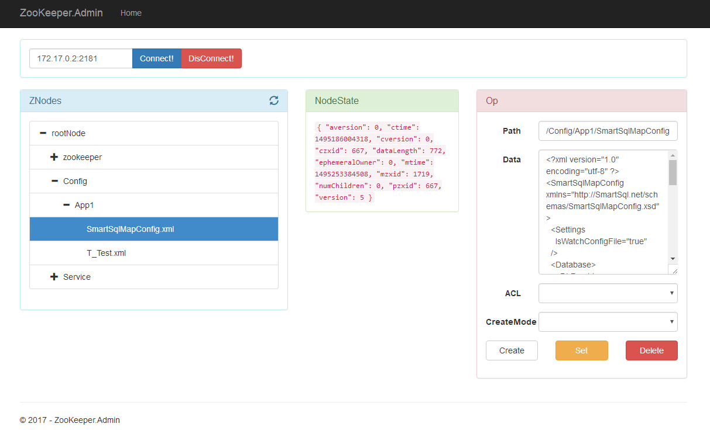

# ZooKeeper-Admin

ZooKeeper 管理工具

## Docker方式安装

``` bash
docker pull ahoowang/zookeeper.admin
docker run --name zooAdmin -p 80:80 ahoowang/zookeeper.admin
```

## 本地运行

``` bash
git clone https://github.com/Ahoo-Wang/ZooKeeper-Admin.git
dotnet run
```

## Demo

